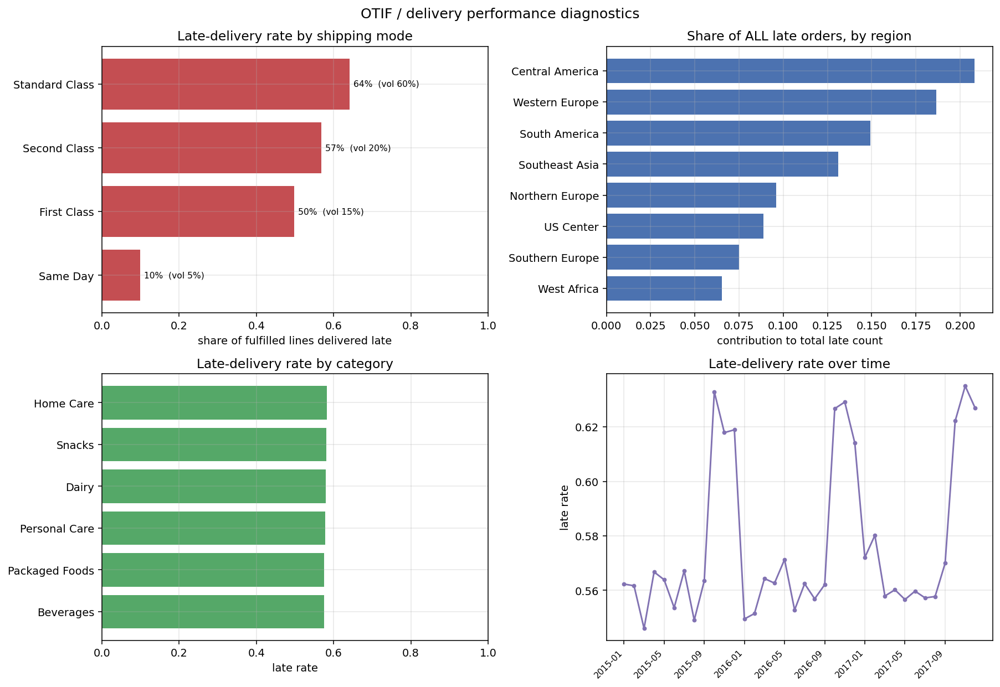
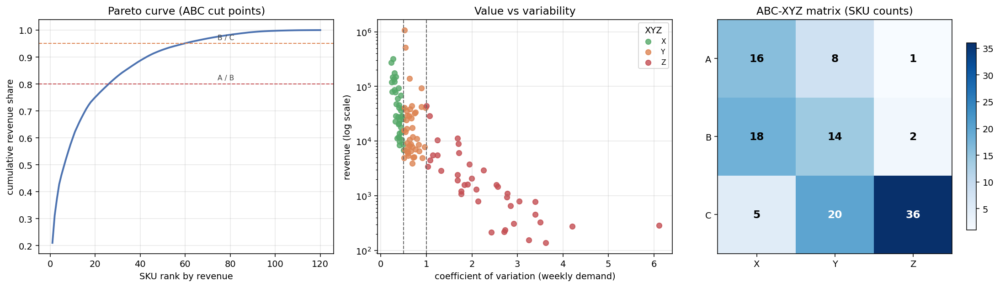
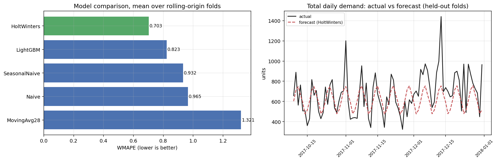
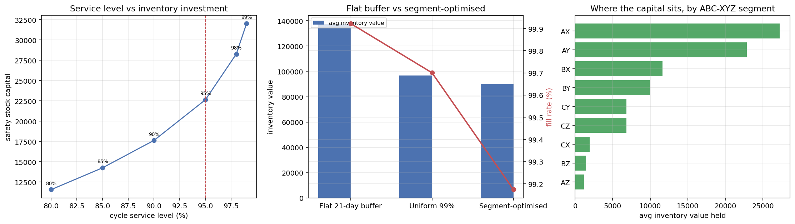

# Results

Data source: `synthetic`  

Clean order lines: **237,436** (231,836 fulfilled, 5,600 cancelled/fraud excluded from OTIF)

## 1. Delivery performance (OTIF)

- On-time rate: **42.2%** (late rate 57.8%)
- Average slip when late: **1.79 days**
- Worst mode: **Standard Class** at a 64.1% late rate, carrying **66.5% of all late orders**
- Top 2 regions account for **39.5%** of late orders
- Revenue exposed to late delivery: **2,958,185**

### Chi-square independence tests

| Dimension | chi2 | p-value | Cramer's V |
|---|---:|---:|---:|
| shipping_mode | 14,008.8 | 0 | 0.246 |
| order_region | 8,022.9 | 0 | 0.186 |
| category_name | 5.9 | 0.32 | 0.005 |

## 2. ABC-XYZ segmentation

- **25** A-class SKUs (21% of the catalogue) drive **79%** of revenue
- **39** SKUs are erratic (weekly CV >= 1.0)
- **16** SKUs qualify for automated replenishment (AX)

| Segment | SKUs | Revenue share | Mean CV | Policy |
|---|---:|---:|---:|---|
| AX | 16 | 39.3% | 0.31 | Automate replenishment; low safety stock; tight cycle counting |
| AY | 8 | 39.0% | 0.71 | Weekly review; seasonal buffer; forecast with seasonality model |
| BX | 18 | 8.3% | 0.41 | Periodic auto-replenishment; standard buffer |
| BY | 14 | 6.6% | 0.64 | Monthly review; moderate buffer |
| CY | 20 | 2.7% | 0.68 | Low priority; simple reorder point |
| CZ | 36 | 1.5% | 2.40 | Make-to-order or delist; do not hold stock |
| CX | 5 | 0.9% | 0.45 | Bulk order infrequently; minimise handling cost |
| AZ | 1 | 0.9% | 1.00 | Manual planner review; high buffer or make-to-order; hedge supply |
| BZ | 2 | 0.8% | 1.38 | Reduce commitment; consider vendor-managed inventory |

## 3. Demand forecasting

Rolling-origin CV, 3 folds x 28-day horizon, 59 A/B SKUs.

| Model | WMAPE | MAE | RMSE | Bias | vs seasonal naive |
|---|---:|---:|---:|---:|---:|
| HoltWinters | 0.703 | 7.99 | 20.34 | +0.96 | +24.6% |
| LightGBM | 0.823 | 9.38 | 25.41 | +5.58 | +11.7% |
| SeasonalNaive | 0.932 | 10.61 | 28.38 | +0.29 | +0.0% |
| Naive | 0.965 | 11.02 | 29.41 | +0.13 | -3.5% |
| MovingAvg28 | 1.321 | 15.02 | 32.71 | +5.47 | -41.7% |

Best model: **HoltWinters**, WMAPE **0.703**, **24.6%** better than the seasonal-naive baseline.

## 4. Inventory optimisation

| Policy | Fill rate | Avg inventory value | Holding cost | Ordering cost | Total cost |
|---|---:|---:|---:|---:|---:|
| Flat 21-day buffer | 99.92% | 137,565 | 34,391 | 14,625 | 49,016 |
| Uniform 99% | 99.70% | 96,888 | 24,222 | 14,650 | 38,872 |
| Segment-optimised | 99.17% | 89,917 | 22,479 | 14,600 | 37,079 |

Segment-differentiated safety stock cuts inventory capital by **34.6%** and total cost by **24.4%** versus a flat 21-day buffer, while holding fill rate at **99.17%**.
Against a uniform 99% rule it still saves **7.2%** of capital, which shows the gain comes from differentiating service levels rather than simply holding less stock.

